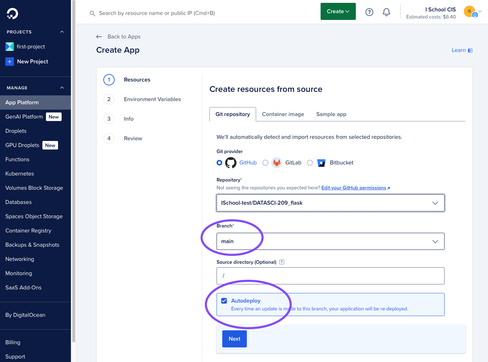
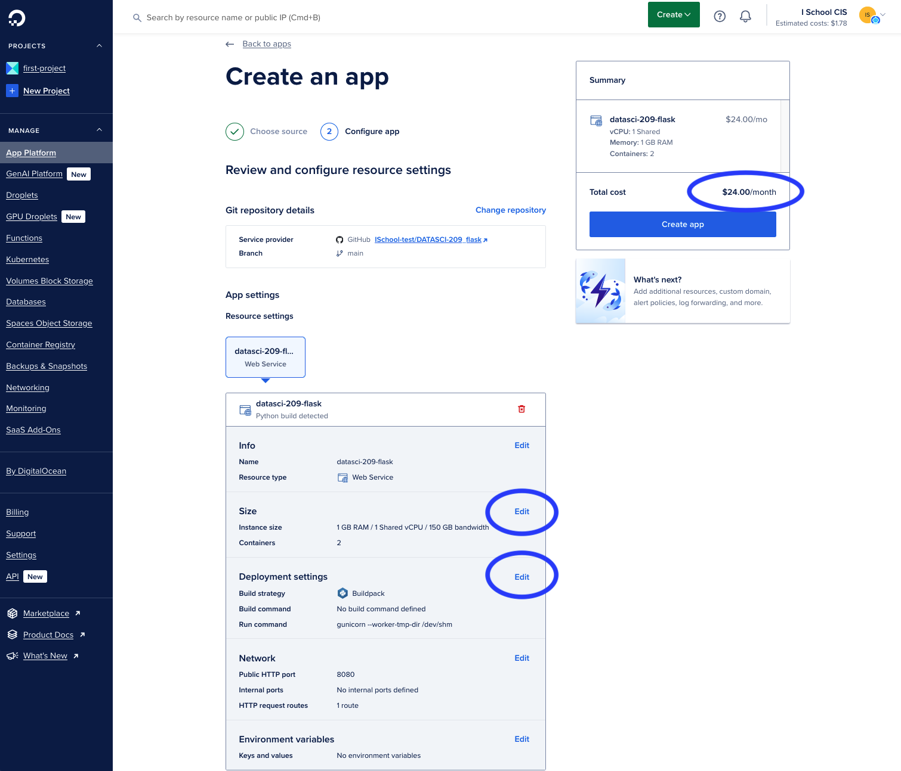
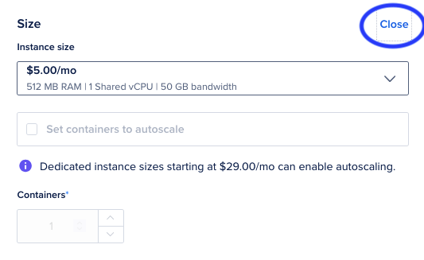
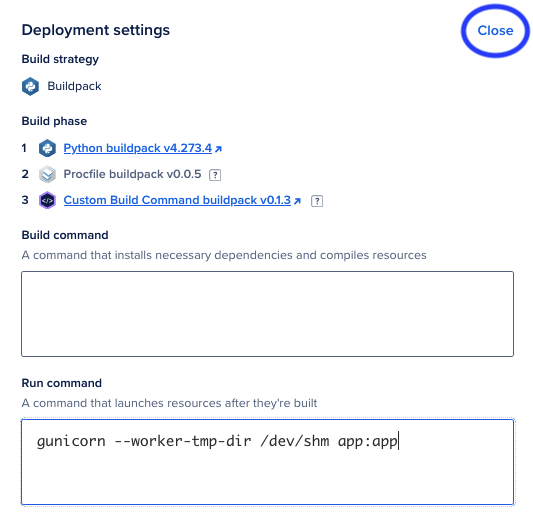
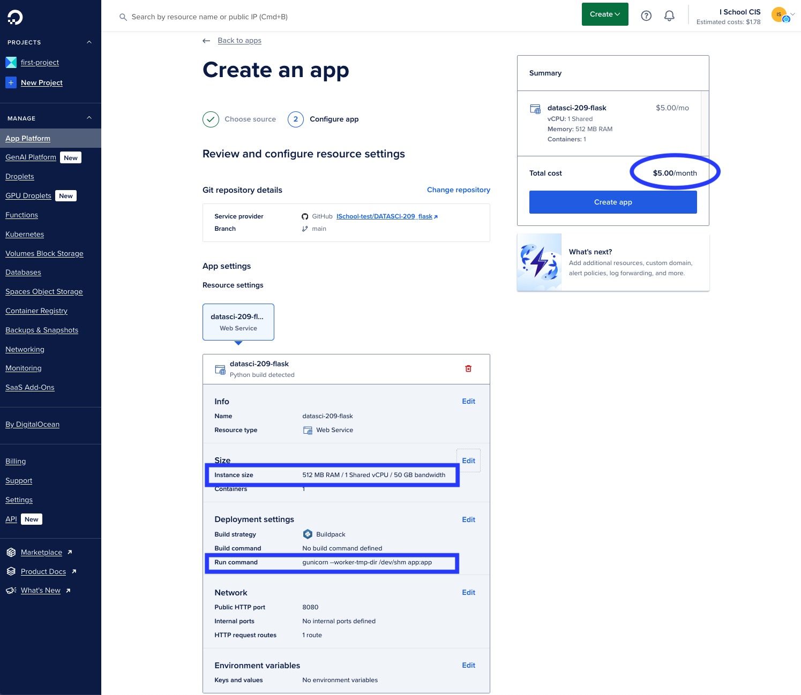
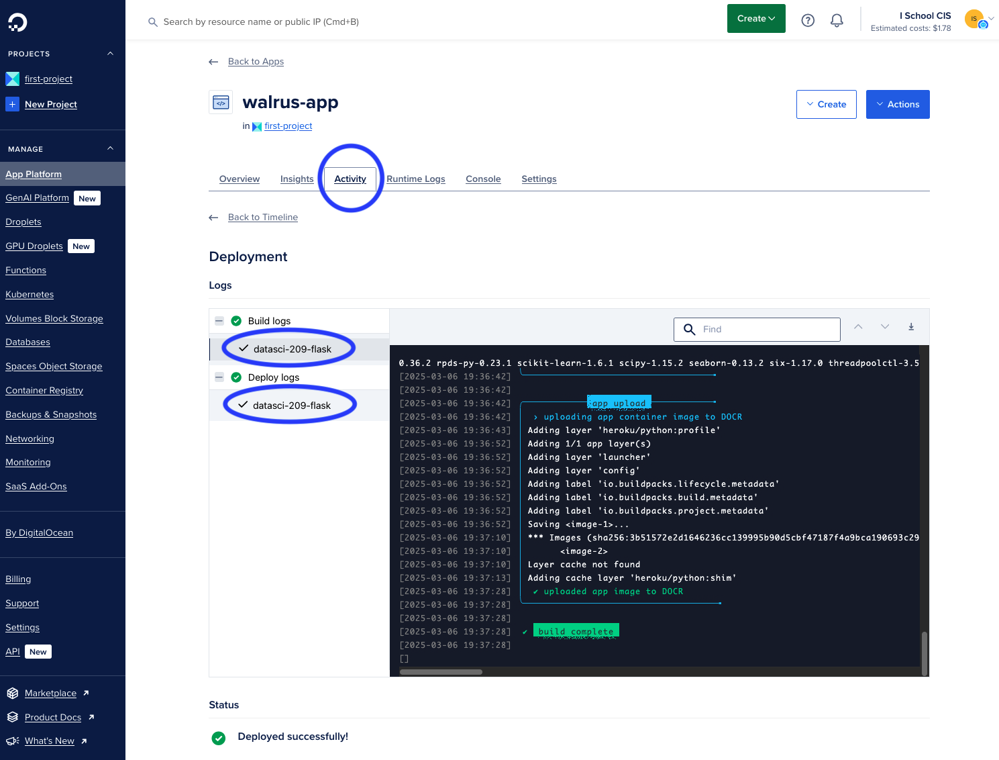
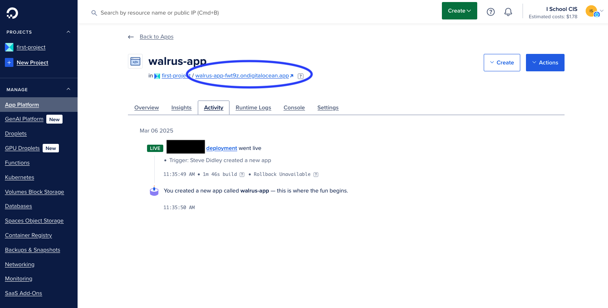

# DATASCI 209 flask template

This repo provides a basic flask app for DATASCI 209 students and instructors. You can run this flask app locally for development/debugging or deploy it to Digital Ocean's [App Platform](https://www.digitalocean.com/products/app-platform).

## Getting Started

1. Install Python 3.x on your computer.
2. [Create a copy](https://docs.github.com/en/repositories/creating-and-managing-repositories/creating-a-repository-from-a-template#creating-a-repository-from-a-template) of this repo in your personal GitHub workspace. For example, if your GitHub username is **octocat**, you would make octocat the owner of your copy of the repository.
```
DO NOT create your copy of this repo in a GitHub organization owned by someone else
or you might not be able to deploy your flask application to Digital Ocean's App Platform.
```
3. Clone your copy of this repo from GitHub to your computer.

## Local Development

**Install dependencies**

Open a terminal and navigate to the folder that contains your local copy of this repo.  Run the following command to install the necessary Python libraries:

**Mac**
```
pip3 install -r requirements.txt
```

**Windows**
```
py -m pip install -r requirements.txt
```

See the [pip documentation](https://pip.pypa.io/en/stable/cli/pip_install/) if you need more information about installing Python libraries with pip.

**Run your app locally**

In the folder where you cloned a copy of this repo, run the following command.  The --debug option will cause flask to automatically load any code changes you make.

```
flask --app app.py --debug run
```

**Point your browser to http://127.0.0.1:5000**

When running your app locally with the --debug flag, flask's built-in debugger will provide an interactive traceback in your browser.  You can also use an external debugger such as the one in your preferred IDE to troubleshoot your code.  See the flask [Debugging Application Errors](https://flask.palletsprojects.com/en/stable/debugging/) documentation for more information on debugging your flask app.

## Hosting your flask app on Digital Ocean

Digital Ocean provides a public cloud platform that you can use to host your flask app.

**Please note**

1. Digital Ocean does not offer free App Platform hosting.  The smallest App Platform VM costs $5 per month as of October 2024.
2. DATASCI 209 students may be eligible for a free higher education credit from Digital Ocean.  See Digital Ocean's [GitHub Student Developer](https://www.digitalocean.com/github-students) page for more information.
3. Automatically deploying your code changes to App Platform requires installing the Digital Ocean GitHub app.  It's easier to set up this app in your personal GitHub workspace than in a GitHub organization owned by someone else.  For this reason, we recommend that you keep your flask app repo in your personal GitHub workspace.

**How to deploy your flask app to Digital Ocean**

1. Create a [Digital Ocean](https://www.digitalocean.com) account.

2. Navigate to the [App Platform Homepage](https://cloud.digitalocean.com/apps)

3. Select 'Create App' using GitHub as the Source provider
  

4. You will likely see that Digital Ocean doesn't detect any of your GitHub repos.  If so, select 'Edit your GitHub permissions'.
  

5. You will be prompted to install and authorize the Digital ocean GitHup app.  For security, it's a good idea to only grant the Digital Ocean GitHub app access to your copy of the DATASCI 209 flask template repo.
  

6. After you grant the Digital Ocean GitHub app access to your repo, make sure it's tracking the main branch of your repo and that autodeploy is enabled.  This will automatically deploy any updates to the main branch of your repo to Digital Ocean's app platform.
  

7. After you set up access to your GitHub repo, Digital Ocean will display the 'Create an app' screen.  You will need to edit two resource settings before you launch your app:
  * **Size**: The default VM size costs $24 per month, your flask app should run on the smallest VM which costs only $5 per month.
  * **Deployment settings**: You will need to update the default 'Run command' setting.  
  

8. Click on the edit button next to the 'Size' parameter and select the smallest instance size available. Unless your flask app is doing something resource intensive on the back end, the smallest Digital Ocean resource size should be fine.



9. Click on the edit button next to the 'Deployment settings' parameter and replace the default run command with the following:
  ```
   gunicorn --worker-tmp-dir /dev/shm app:app
   ```


10. Verify that your instance size is correct, your run command is correct and that the monthly charge is $5. If everything looks good, click the 'Create app' button.
  

11. After you create your app, switch from the 'Overview' to the 'Activity' tab so you can track your app's build and deployment progress.  You can view the build and deploy logs from this tab if you need to troubleshoot a failed deployment
  


12. After your deployment completes, reload the activity tab in your web browser.  The UI should display your app's URL below the app name.  Note that Digital Ocean assigned the name 'walrus-app' to this flask app.  These names are randomly assigned.
  
`
12. Be sure to bookmark your flask app's URL so you can find it without using the Digital Ocean web UI.

13. if you need additional assistance deploying your flask app to Digital Ocean's App Platform:

  * See Ditigal Ocean's [How To Troubleshoot Apps in App Platform](https://docs.digitalocean.com/support/how-to-troubleshoot-apps-in-app-platform/) guide.
  * Go to Digital Ocean's [Support page](https://cloud.digitalocean.com/account/support) and create a support request using the 'Create a ticket' link.
